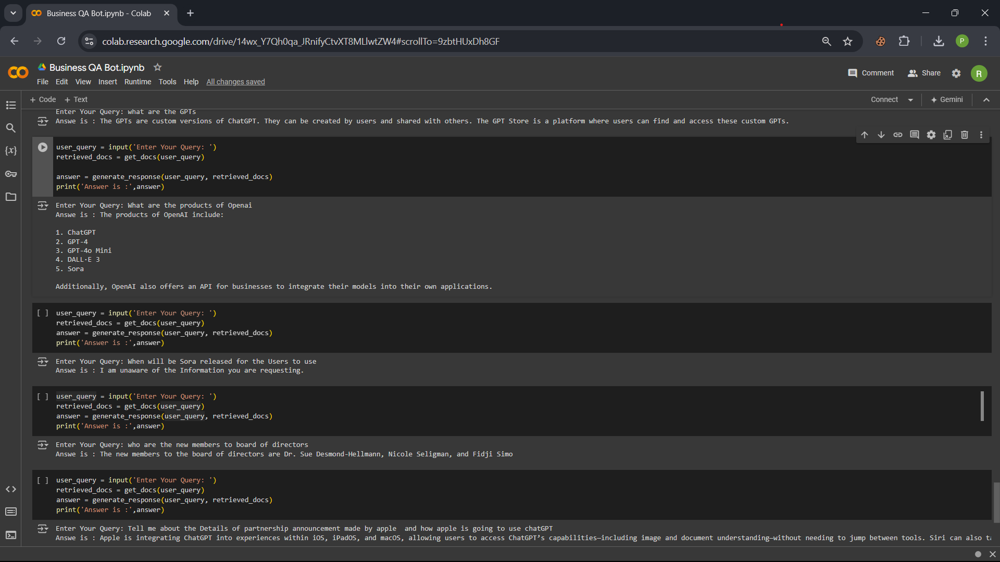

# Business QA Bot

>Business QA Bot is an advanced Retrieval Augmented Generation (RAG) based Question-Answering bot designed specifically for business applications. This project showcases innovative techniques to optimize RAG models, enhancing performance, efficiency, and output quality for business-oriented queries.

## Preview:

## About RAG

Retrieval Augmented Generation (RAG) is a powerful approach in natural language processing that combines the strengths of large language models with the ability to access and leverage external knowledge. RAG models first retrieve relevant information from a knowledge base and then use this information to generate more accurate and contextually appropriate responses.

## Importance of RAG-based QA Bots in Business

RAG-based QA bots offer several key advantages in business settings:

- **Accurate and Up-to-date Information:** By accessing current business data, these bots provide precise and timely answers to queries.
- **Customization:** They can be tailored to specific business domains and knowledge bases.
- **Scalability:** RAG bots can handle a growing volume of information and queries efficiently.
- **Consistency:** They ensure uniform responses across different customer or employee interactions.
- **24/7 Availability:** Provide round-the-clock access to business information and support.
- **Cost-effective:** Reduce the workload on human support teams for routine queries.
- **Data-driven Insights:** Analysis of user queries can reveal valuable business intelligence.

## Key Features

- **Efficient Data Collection:** Utilizes Firecrawl API for comprehensive website content extraction.
- **Optimized Chunk Size:** Implements a 512-token chunk size for balanced and effective embeddings.
- **Advanced LLM Integration:** Leverages Gemini-1.5-Flash for expanded context handling and rapid inference.
- **High-Speed Inference:** Employs Groq LPU™ AI technology for near-instantaneous response generation.

## Acknowledgments

- Google for the Gemini-1.5-Flash model
- Groq for their LPU™ AI inference technology
- Firecrawl for their efficient web crawling API
- Pinecone for the Vector Databse provider

